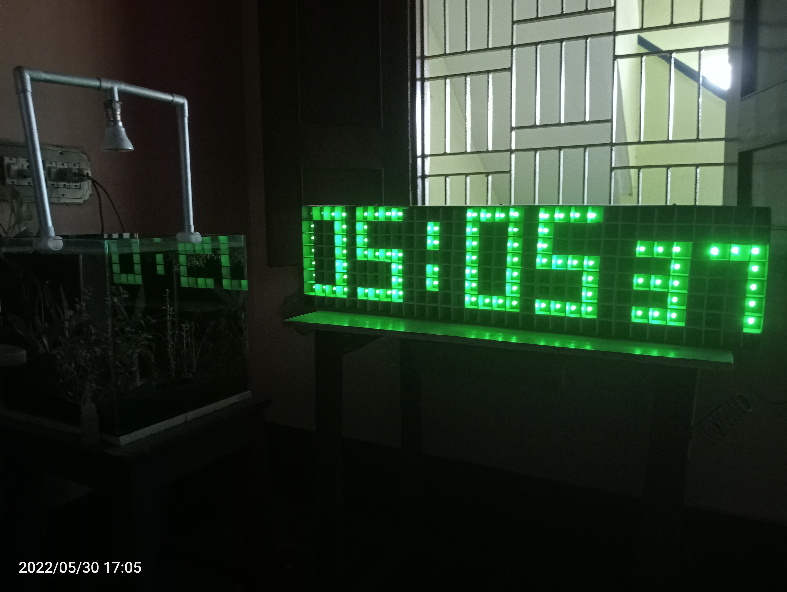

# ESP8266-Based Smart LED Matrix Clock (Custom Build)

## 🚀 Project Overview
This project is a **handmade 32x8 LED matrix clock**, powered by an **ESP8266** and controlled using **MAX7219 LED drivers**. The **LED matrix panel was manually built**, with each LED individually soldered and mounted inside a **custom-built MDF/sunboard enclosure**. The display shows **time, date, temperature, and custom scrolling text**, all fetched via WiFi from an **NTP server**.
[Images/The Design.jpg](https://github.com/hiteshpanigrahi/IoT_based_Smart_LED_Matrix/blob/main/Images/The%20Design.jpg)
---

## 🔥 Features
✅ **Displays NTP Time, Date, and Temperature**  
✅ **Custom Scrolling Text**  
✅ **Wi-Fi Configuration via Web Interface**  
✅ **OTA Firmware Updates**  
✅ **Handcrafted MDF/Sunboard Frame**  
✅ **Modular MAX7219 LED Matrix Design**  

---

## 🛠️ Hardware Components
| **Component** | **Quantity** |
|--------------|------------|
| ESP8266 NodeMCU | 1 |
| MAX7219 LED Driver | 4 |
| 5mm Green LEDs | 320 |
| MDF Board | 1 |
| Sunboard | 1 |
| Connecting Wires | Multiple |
| 5V 2A Adapter | 1 |

---

## 🔌 Wiring & Connections
Refer to the **[Wiring Guide](esp8266_max7219_wiring.md)** for detailed wiring connections between ESP8266, MAX7219, and the LED matrix.

---

## 📜 Software & Firmware
### 🔹 Firmware Source
This project uses firmware from **[ESP8266 WiFi Matrix Clock](https://github.com/yuan910715/Esp8266_Wifi_Matrix_Clock)** by **yuan910715**.

### 🔹 Flashing the Firmware
1. Download **ESP8266Flasher** and select the provided `.bin` firmware file.
2. Connect NodeMCU to your PC via USB.
3. Flash the firmware using ESP8266Flasher.
4. Connect to Wi-Fi and configure via the web interface.

---

## 📸 Project Image

---

## ⚙️ Future Upgrades
✅ **RTC Module** to enable offline timekeeping.  
✅ **Real-time temperature sensor** for indoor temperature display.  
✅ **Increased LED matrix size** for better visuals.  
✅ **More text scrolling animations**.  

---

## 📜 Credits
- **Firmware Source:** [ESP8266 WiFi Matrix Clock](https://github.com/yuan910715/Esp8266_Wifi_Matrix_Clock) by **yuan910715**
- **Hardware Design & Assembly:** [Your Name]  
- **Documentation & Report:** [Your Name]  

---

